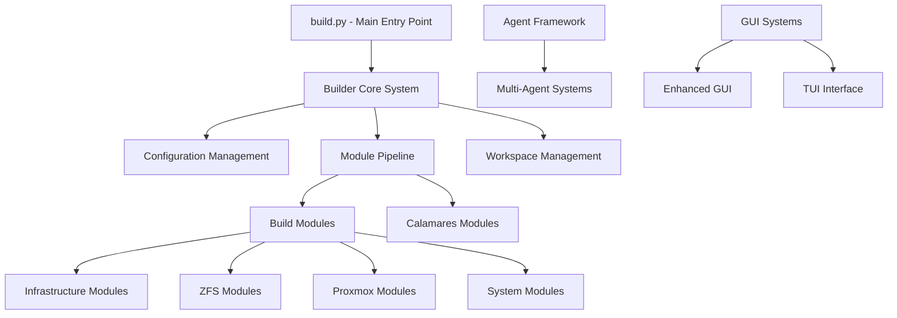

# Z-FORGE Project - Architectural Analysis

## Executive Summary

Z-FORGE is a sophisticated, modular Linux distribution builder designed to create ZFS-enabled Proxmox and custom ISOs. The project demonstrates enterprise-grade architecture with clean separation of concerns, extensive modularity, and robust error recovery mechanisms.

## 1. System Architecture Overview

### 1.1 High-Level Architecture



### 1.2 Core Design Principles

- **Modular Architecture**: Highly decoupled components with clear interfaces
- **Configuration-Driven**: YAML-based configuration system with multiple build specs
- **Fault-Tolerant**: Comprehensive error recovery and retry mechanisms  
- **Agent-Based**: Multi-agent coordination for complex build operations
- **Hardware-Aware**: Dynamic hardware detection and optimization

## 2. Component Dependencies and Relationships

### 2.1 Core Dependency Graph

```
build.py
├── builder/core/builder.py (ZForgeBuilder)
│   ├── builder/core/config.py (BuildConfig)
│   ├── builder/core/lockfile.py (BuildLockfile)
│   └── builder/modules/* (Build Modules)
├── calamares/modules/* (Installer Modules)
├── scripts/agents/* (UltraThink Agents)
└── build_specs/*.yml (Configuration)
```

### 2.2 Module Interdependencies

**Critical Path Dependencies:**
1. `WorkspaceSetup` → `Debootstrap` → `KernelAcquisition`
2. `KernelAcquisition` → `ZFSBuild` → `ProxmoxIntegration`
3. `LiveEnvironment` → `DracutConfig` → `BootloaderSetup`
4. `CalamaresIntegration` → `SecurityHardening` → `ISOGeneration`

**Shared Dependencies:**
- All modules depend on `BuildConfig` for configuration
- Workspace management shared across all build operations
- Hardware detection results used by multiple modules

## 3. Build System Architecture

### 3.1 Builder Framework (`builder/`)

**Core Components:**

- **`core/builder.py`** - Main orchestration engine (ZForgeBuilder class)
  - Module pipeline execution with resume capability
  - Dynamic module loading with naming convention conversion
  - Progress tracking and lockfile management
  - Error handling with detailed logging

- **`core/config.py`** - Configuration management system
  - YAML-based configuration with validation
  - Default configuration generation
  - Environment variable integration
  - Multi-build-spec support

- **`core/lockfile.py`** - Build state management
  - Version tracking and dependency resolution
  - Module execution history
  - Resume capability for failed builds

### 3.2 Module System Architecture

**Module Structure Pattern:**
```python
class ModuleName:
    def __init__(self, workspace: Path, config: Dict):
        # Module initialization
    
    def execute(self, resume_data: Optional[Dict] = None, 
                lockfile: Optional[BuildLockfile] = None) -> Dict:
        # Module execution with resume capability
```

**Key Architectural Features:**
- **Dynamic Loading**: Modules loaded via `importlib` with CamelCase to snake_case conversion
- **Resume Support**: Each module can save/restore checkpoint data
- **Lockfile Integration**: Version tracking and dependency management
- **Error Recovery**: Comprehensive error reporting with actionable recommendations

### 3.3 Makefile System (`config/`)

**Build Targets:**
- `build` - Full automated build with environment checks
- `build-spec` - Build with specific YAML configuration
- `resume` - Resume failed build from checkpoint
- `clean` - Safe workspace cleanup
- `debug` - Build with verbose logging

**Environment Integration:**
- `ZFORGE_WORKSPACE` environment variable support
- Automatic sudo elevation for root operations
- Build dependency management for Debian/Ubuntu

## 4. Module Structure Analysis

### 4.1 Build Modules (`builder/modules/`)

**Infrastructure Modules:**
- `workspace_setup.py` - Build environment preparation
- `workspace_safety.py` - Safety checks and validation
- `workspace_cleanup.py` - Cleanup and resource management
- `system_prerequisites.py` - System dependency verification

**Core System Modules:**
- `debootstrap.py` - Minimal Debian system creation
- `kernel_acquisition.py` - Kernel installation and management
- `live_environment.py` - Live system configuration
- `desktop_environment.py` - Desktop environment setup

**ZFS-Specific Modules:**
- `zfs_build.py` - OpenZFS compilation and installation
- `zfs_encryption.py` - ZFS encryption setup
- `zfs_compression_optimizer.py` - Performance optimization
- `zfs_pool_config.py` - Storage pool configuration

**Proxmox Integration Modules:**
- `proxmox_integration.py` - Core Proxmox VE integration
- `proxmox_repo_setup.py` - Repository configuration
- `proxmox_package_install.py` - Package installation
- `proxmox_network_config.py` - Network configuration
- `proxmox_storage_config.py` - Storage configuration
- `proxmox_service_config.py` - Service management

**Bootloader Modules:**
- `bootloader_setup.py` - Bootloader installation
- `zfsbootmenu_install.py` - ZFSBootMenu integration
- `dracut_config.py` - Initramfs configuration

### 4.2 Calamares Integration (`calamares/`)

**Installer Module Architecture:**
```
calamares/
├── modules/              # Custom installer modules
├── libcalamares/        # Mock Calamares library
├── PyQt5/               # PyQt5 compatibility layer
└── settings.conf        # Calamares configuration
```

**Custom Installer Modules:**
- `zfsenhancedconfig/` - Advanced ZFS configuration GUI
- `zfsrootselect/` - ZFS root filesystem selection
- `zfspooldetect/` - ZFS pool detection and validation
- `hardwarehealth/` - Hardware health monitoring
- `securityhardening/` - Security configuration
- `gpupassthrough/` - GPU passthrough setup
- `networkconfig/` - Network configuration
- `storagelayout/` - Storage layout management

## 5. Agent Framework Architecture

### 5.1 UltraThink Multi-Agent System (`scripts/agents/`)

**Agent Coordination Pattern:**
```python
class BaseAgent:
    - Message passing via coordinator queue
    - Structured finding and recommendation system
    - Threaded execution for parallel analysis
```

**Specialized Agents:**
- **`ChrootDiagnosticsAgent`** - Environment analysis
- **`PackageResolutionAgent`** - APT and package fixes
- **`BuildFlowAgent`** - Build pipeline analysis
- **`TestingValidationAgent`** - Fix validation

**Agent Communication Architecture:**
- Queue-based message passing
- Structured finding/recommendation format
- Parallel execution with timeout handling
- Comprehensive report generation

### 5.2 Claude Agent Framework (`~/.local/share/claude/agents/`)

**Framework Components:**
- **Binary Communication System** - High-performance C-based IPC
- **Python Integration Layer** - Python-C bridge for agent coordination
- **Monitoring System** - Prometheus/Grafana integration
- **Service Management** - Systemd integration for agent lifecycle

**Agent Specializations:**
- `Architect.md` - System architecture analysis
- `Constructor.md` - Build system construction
- `Debugger.md` - Advanced debugging capabilities
- `Security.md` - Security analysis and hardening
- `Infrastructure.md` - Infrastructure management

## 6. Configuration and Build Specifications

### 6.1 Build Specification System (`build_specs/`)

**Available Build Configurations:**
- `build_spec.yml` - Default configuration (Trixie-based)
- `build_spec_proxmox_full.yml` - Full Proxmox integration
- `build_spec_proxmox9.yml` - Proxmox VE 9 specific
- `build_spec_stable.yml` - Stable Debian base
- `build_spec_trixie_clean.yml` - Clean Trixie build
- `build_spec_tmpfs.yml` - TMPFS-based build
- `build_spec_no_tmp.yml` - Outside /tmp workspace

### 6.2 Configuration Architecture

**Configuration Hierarchy:**
```yaml
builder_config:          # Core build settings
proxmox_config:          # Proxmox-specific settings  
zfs_config:              # ZFS configuration
bootloader_config:       # Bootloader settings
hardware_detection:      # Hardware detection settings
calamares_config:        # Installer configuration
modules:                 # Module execution sequence
```

**Dynamic Configuration Features:**
- Environment variable integration (`ZFORGE_WORKSPACE`)
- Hardware-specific optimization
- Multiple build target support
- Debug mode configuration

## 7. Hardware and Platform Support

### 7.1 Hardware Database (`builder/modules/hardware_db.py`)

**Hardware Profile System:**
```python
@dataclass
class HardwareProfile:
    name: str
    vendor: str  
    model: str
    optimizations: List[str]
    required_modules: List[str]
    zfs_settings: Dict[str, Any]
```

**Supported Hardware Platforms:**
- Dell PowerEdge servers (R320, R420, R730xd, T30)
- Dell PERC controllers (H710, H730mini, S130) 
- Generic x86_64 systems
- NVME optimization support

### 7.2 Hardware-Specific Configurations (`config/`)

**Per-Platform Build Specs:**
- `r420/` - Dell R420 specific optimizations
- `r730xd/` - Dell R730xd configuration
- `t30/` - Dell T30 workstation setup
- `universal/` - Generic hardware support

## 8. Development and ZFS Environment

### 8.1 ZFS Development Environment (`linux-6.14.5/`)

**Complete ZFS Source Tree:**
```
linux-6.14.5/
└── zfs-build/
    ├── zfs-2.3.3/          # Complete OpenZFS source (1.1GB)
    ├── build scripts       # Multiple build approaches
    └── utilities/          # ZFS management utilities
```

**ZFS Build Strategies:**
- Source compilation with optimization
- Debian package building
- Proxmox-specific packaging
- Performance-optimized builds

### 8.2 Build Automation (`zfs-builds/`)

**Automated Build Scripts:**
- `build-zfs-2.3.3-debian-packages.sh` - Debian packaging
- `build-zfs-optimized.sh` - Performance optimization
- `fix-zfs-build.sh` - Build issue resolution
- `upgrade-zfs-trixie.sh` - Version management

## 9. Documentation and Project Organization

### 9.1 Documentation Architecture (`docs/`)

**Documentation Categories:**
- **Guides** (`guides/`) - Step-by-step instructions
- **Analysis** (`analysis/`) - Technical analysis reports  
- **Hardware** (`hardware/`) - Hardware compatibility
- **Integration** (`integration/`) - System integration docs
- **Reports** (`reports/`) - Build and test reports

**Navigation System:**
- `WHERE_AM_I.md` files in each directory
- `DOCUMENTATION_INDEX.md` for comprehensive navigation
- Cross-referenced guide system

### 9.2 Project Organization Patterns

**Organizational Principles:**
- Clear separation of concerns
- Modular directory structure
- Comprehensive documentation
- Version control integration
- Backup and archive management

## 10. Testing and Validation

### 10.1 Testing Infrastructure (`tests/`)

**Test Categories:**
- Unit tests for individual modules
- Integration tests for system components
- Calamares installer testing
- Full system validation

### 10.2 Diagnostic Tools (`tools/`)

**Diagnostic Capabilities:**
- `build_diagnostic_tool.py` - Build issue analysis
- `test_enhanced_gui.py` - GUI functionality testing
- `analyze_build_failures.py` - Failure pattern analysis

## 11. GUI and User Interface

### 11.1 Enhanced GUI System

**GUI Architecture:**
- PyQt5-based enhanced interface
- Real-time build monitoring
- Error recovery integration
- Hardware detection display

### 11.2 Terminal User Interface

**TUI Features:**
- Terminal-based build interface
- Progress monitoring
- Interactive configuration
- Remote operation support

## 12. Security and Hardening

### 12.1 Security Architecture

**Security Components:**
- Workspace isolation and validation
- Package integrity verification
- Secure chroot environment management
- Permission and access control

### 12.2 Security Modules

**Hardening Features:**
- `security_hardening.py` - System security configuration
- `securityhardening/` - Calamares security module
- Encrypted ZFS support
- Secure boot integration

## 13. Performance and Optimization

### 13.1 Build Optimization

**Performance Features:**
- Parallel module execution where possible
- Intelligent caching system
- Hardware-specific optimizations  
- TMPFS build option for speed

### 13.2 Resource Management

**Resource Optimization:**
- Disk space management and validation
- Memory usage optimization
- Network bandwidth management
- CPU utilization balancing

## 14. Error Recovery and Fault Tolerance

### 14.1 Recovery Mechanisms

**Fault Tolerance Features:**
- Build checkpoint and resume system
- Multi-level error recovery
- Automatic retry with backoff
- Graceful degradation

### 14.2 Diagnostic and Recovery Systems

**Recovery Tools:**
- UltraThink multi-agent diagnostics
- Automated fix script generation
- Build state analysis
- Environment repair utilities

## 15. Conclusion

Z-FORGE represents a mature, enterprise-grade build system with exceptional architectural design. Key strengths include:

- **Modularity**: Clean separation with well-defined interfaces
- **Reliability**: Comprehensive error handling and recovery
- **Flexibility**: Multiple build targets and configurations
- **Maintainability**: Clear documentation and organization
- **Scalability**: Agent-based systems for complex operations

The project demonstrates best practices in:
- Configuration management
- Module system design
- Error recovery patterns
- Documentation architecture
- Testing strategies

This architecture enables Z-FORGE to successfully build complex ZFS-enabled Linux distributions with high reliability and maintainability.

---
*Analysis generated on 2025-08-18 by Claude Code ARCHITECT agent*
*Project Root: `/home/ubuntu/Documents/Z-FORGE`*